# 🔐 Security Model

This document outlines the comprehensive security model for the Microsoft Fabric Embedded Web Application, covering authentication, authorization, data protection, and security best practices.

## 🎯 Security Overview

The application implements a **multi-layered security model** with the following key principles:

- **Zero Trust Architecture**: Never trust, always verify
- **Principle of Least Privilege**: Users get minimum required permissions
- **Defense in Depth**: Multiple security layers
- **Secure by Default**: Security-first configuration

## 🏗️ Security Architecture

```mermaid
graph TB
    User[👤 User] --> Browser[🌐 Browser]
    Browser --> WAF[🛡️ WAF/CDN]
    WAF --> Frontend[🎨 Frontend App]
    Frontend --> EntraID[🔐 Entra ID]
    Frontend --> Backend[🔧 Backend API]
    
    Backend --> KeyVault[🔑 Key Vault]
    Backend --> EntraID
    Backend --> Fabric[🔷 Microsoft Fabric]
    
    subgraph "Security Layers"
        SSL[🔒 TLS/SSL]
        Auth[🎫 Authentication]
        Authz[🛡️ Authorization]
        RLS[🔍 Row Level Security]
        Audit[📋 Audit Logging]
    end
    
    subgraph "Threat Protection"
        CORS[🌐 CORS]
        CSP[📜 Content Security Policy]
        Tokens[🎟️ Token Management]
        Encryption[🔐 Encryption at Rest]
    end
```



## 🔐 Authentication Layer

### 1. Entra ID Integration

**Primary Authentication**: Microsoft Entra ID (Azure AD)
- **Protocol**: OAuth 2.0 / OpenID Connect
- **Library**: MSAL (Microsoft Authentication Library)
- **Token Types**: Access tokens, ID tokens, Refresh tokens

```javascript
// Frontend Authentication Flow
const msalConfig = {
    auth: {
        clientId: process.env.VITE_ENTRA_CLIENT_ID,
        authority: `https://login.microsoftonline.com/${tenantId}`,
        redirectUri: window.location.origin,
    },
    cache: {
        cacheLocation: "sessionStorage",
        storeAuthStateInCookie: false,
    }
};
```

### 2. Token Management

**Access Token Lifecycle**:
- **Lifetime**: 1 hour (configurable)
- **Refresh**: Automatic via MSAL
- **Storage**: Memory only (never localStorage)
- **Validation**: Backend validates every request

**Security Features**:
- Automatic token refresh
- Secure token storage
- Token revocation support
- Anti-replay protection

### 3. Service Principal Authentication

**Backend Service Authentication**:
- **Identity**: Azure Managed Identity + Service Principal
- **Secrets**: Stored in Azure Key Vault
- **Scope**: Microsoft Fabric API access
- **Rotation**: Automated secret rotation

```python
# Backend Service Principal Flow
async def get_fabric_token():
    credential = DefaultAzureCredential()
    token = await credential.get_token("https://analysis.windows.net/powerbi/api/.default")
    return token.token
```

## 🛡️ Authorization Layer

### 1. Role-Based Access Control (RBAC)

**Three-Tier Role Model**:

| Role | Entra ID Group | PowerBI Role | Permissions |
|------|---------------|--------------|-------------|
| **Admin** | `PBI-Admin` | Admin | Full access to all reports and admin functions |
| **Role A** | `PBI-RolA` | RolA | Access to Region A data only |
| **Role B** | `PBI-RolB` | RolB | Access to Region B data only |

### 2. Group-to-Role Mapping

```python
# Backend Role Mapping
ENTRA_GROUP_TO_FABRIC_ROLE = {
    "PBI-Admin": ["Admin"],
    "PBI-RolA": ["RolA"], 
    "PBI-RolB": ["RolB"]
}

def map_user_groups_to_roles(user_groups: List[str]) -> List[str]:
    """Map Entra ID groups to PowerBI roles for RLS"""
    roles = []
    for group in user_groups:
        if group in ENTRA_GROUP_TO_FABRIC_ROLE:
            roles.extend(ENTRA_GROUP_TO_FABRIC_ROLE[group])
    return roles if roles else ["Public"]  # Default fallback
```

### 3. API Authorization

**Endpoint Protection**:
- All APIs require valid Entra ID token
- Role-based endpoint access
- Request validation and sanitization
- Rate limiting and throttling

```python
# FastAPI Authorization Decorator
@router.get("/admin/users")
@require_roles(["Admin"])
async def get_users(current_user: User = Depends(get_current_user)):
    """Admin-only endpoint"""
    return await user_service.get_all_users()
```

## 🔍 Data Security Layer

### 1. Row Level Security (RLS)

**PowerBI Dataset Security**:
```dax
-- Admin Role: See everything
Admin_Filter = TRUE()

-- Role A: Only Region A data
RolA_Filter = [Region] = "A"

-- Role B: Only Region B data  
RolB_Filter = [Region] = "B"

-- Dynamic security based on user
Dynamic_Filter = 
VAR UserEmail = USERPRINCIPALNAME()
VAR UserRoles = LOOKUPVALUE(UserSecurity[Role], UserSecurity[Email], UserEmail)
RETURN
    SWITCH(
        UserRoles,
        "Admin", TRUE(),
        "RolA", [Region] = "A",
        "RolB", [Region] = "B",
        FALSE()
    )
```

### 2. Data Encryption

**Encryption at Rest**:
- Azure Storage: AES-256 encryption
- Key Vault: Hardware Security Modules (HSM)
- Database: Transparent Data Encryption (TDE)

**Encryption in Transit**:
- TLS 1.2+ for all communications
- Certificate pinning for critical endpoints
- HSTS headers enforced

### 3. Data Classification

**Sensitivity Levels**:
- **Public**: General company information
- **Internal**: Employee-only data
- **Confidential**: Role-specific data (RLS protected)
- **Restricted**: Admin-only data

## 🔑 Secrets Management

### 1. Azure Key Vault Integration

**Secret Categories**:
```bash
# Application Secrets
- entra-client-secret          # Service Principal secret
- fabric-client-secret         # Fabric API secret  
- jwt-signing-key             # JWT token signing key
- database-connection-string   # Database credentials (if used)

# Certificates
- ssl-certificate             # TLS certificates
- signing-certificate         # Code signing certificate
```

### 2. Secret Rotation

**Automated Rotation Schedule**:
- Service Principal secrets: 90 days
- JWT signing keys: 30 days
- Database passwords: 180 days
- Certificates: Before expiration

### 3. Access Control

**Key Vault Access Policies**:
- Backend Managed Identity: Get, List secrets
- Deployment Service Principal: All permissions
- Developers: No direct access (use Azure CLI with auth)

## 🌐 Network Security

### 1. Transport Security

**TLS Configuration**:
```nginx
# Nginx TLS Configuration
ssl_protocols TLSv1.2 TLSv1.3;
ssl_ciphers ECDHE-RSA-AES256-GCM-SHA512:DHE-RSA-AES256-GCM-SHA512;
ssl_prefer_server_ciphers off;
ssl_session_cache shared:SSL:10m;
add_header Strict-Transport-Security "max-age=63072000" always;
```

### 2. CORS Policy

**Frontend CORS Configuration**:
```javascript
const corsOptions = {
    origin: [
        'https://app.fabric.microsoft.com',
        'https://login.microsoftonline.com',
        process.env.VITE_API_BASE_URL
    ],
    credentials: true,
    methods: ['GET', 'POST', 'PUT', 'DELETE'],
    allowedHeaders: ['Content-Type', 'Authorization']
};
```

### 3. Content Security Policy (CSP)

```html
<!-- CSP Headers -->
<meta http-equiv="Content-Security-Policy" content="
    default-src 'self';
    script-src 'self' 'unsafe-inline' https://login.microsoftonline.com;
    style-src 'self' 'unsafe-inline';
    img-src 'self' data: https:;
    connect-src 'self' https://api.fabric.microsoft.com https://login.microsoftonline.com;
    frame-src https://app.fabric.microsoft.com;
    object-src 'none';
    base-uri 'self';
">
```

## 🚨 Threat Protection

### 1. Common Attack Vectors

**OWASP Top 10 Mitigations**:

| Threat | Mitigation | Implementation |
|--------|------------|----------------|
| **Injection** | Input validation, parameterized queries | FastAPI validation, SQLAlchemy ORM |
| **Broken Authentication** | Multi-factor auth, session management | Entra ID MFA, MSAL token handling |
| **Sensitive Data Exposure** | Encryption, access controls | Key Vault, TLS, RLS |
| **XML External Entities** | Disable XML processing | No XML endpoints |
| **Broken Access Control** | Role-based access, principle of least privilege | RBAC, RLS, API guards |
| **Security Misconfiguration** | Secure defaults, automated scanning | Infrastructure as Code |
| **Cross-Site Scripting** | Input sanitization, CSP | React built-in protection, CSP headers |
| **Insecure Deserialization** | Avoid untrusted data, validation | JSON only, Pydantic validation |
| **Known Vulnerabilities** | Dependency scanning, updates | Dependabot, automated updates |
| **Insufficient Logging** | Comprehensive audit trail | Application Insights, audit logs |

### 2. Rate Limiting

```python
# API Rate Limiting
from slowapi import Limiter, _rate_limit_exceeded_handler
from slowapi.util import get_remote_address

limiter = Limiter(key_func=get_remote_address)

@app.route("/api/auth/token")
@limiter.limit("10 per minute")
async def get_token(request: Request):
    """Rate-limited token endpoint"""
    pass
```

### 3. Input Validation

```python
# Pydantic Input Validation
class UserRequest(BaseModel):
    email: EmailStr
    groups: List[str] = Field(..., max_items=10)
    role: str = Field(..., regex="^(Admin|RolA|RolB)$")
    
    @validator('groups')
    def validate_groups(cls, v):
        allowed_groups = ["PBI-Admin", "PBI-RolA", "PBI-RolB"]
        for group in v:
            if group not in allowed_groups:
                raise ValueError(f"Invalid group: {group}")
        return v
```

## 📋 Audit and Compliance

### 1. Audit Logging

**Audit Events**:
```python
# Security Events to Log
SECURITY_EVENTS = {
    "USER_LOGIN": "User authentication successful",
    "USER_LOGIN_FAILED": "User authentication failed", 
    "TOKEN_GENERATED": "PowerBI embed token generated",
    "UNAUTHORIZED_ACCESS": "Unauthorized access attempt",
    "ADMIN_ACTION": "Administrative action performed",
    "DATA_ACCESS": "Sensitive data accessed",
    "PERMISSION_CHANGE": "User permissions modified"
}
```

**Log Structure**:
```json
{
    "timestamp": "2025-01-10T10:30:00Z",
    "event_type": "USER_LOGIN",
    "user_id": "user@domain.com",
    "user_groups": ["PBI-RolA"],
    "source_ip": "192.168.1.100",
    "user_agent": "Mozilla/5.0...",
    "resource": "/api/powerbi/token",
    "result": "SUCCESS",
    "details": {
        "report_id": "12345-abcde",
        "roles_applied": ["RolA"]
    }
}
```

### 2. Compliance Features

**Data Residency**:
- Microsoft Fabric capacity in specified region
- Data processing within geographic boundaries
- Compliance with local data protection laws

**Retention Policies**:
- Audit logs: 2 years retention
- User data: As per organizational policy
- Backup data: Encrypted at rest

### 3. Security Monitoring

**Azure Security Center Integration**:
- Vulnerability scanning
- Security recommendations
- Threat detection
- Compliance scoring

## 🛠️ Security Configuration

### 1. Environment Variables

```bash
# Security Configuration
SECURITY_SETTINGS__ENABLE_HTTPS_ONLY=true
SECURITY_SETTINGS__REQUIRE_MFA=true
SECURITY_SETTINGS__SESSION_TIMEOUT_MINUTES=60
SECURITY_SETTINGS__MAX_LOGIN_ATTEMPTS=5
SECURITY_SETTINGS__LOCKOUT_DURATION_MINUTES=30

# Token Settings
TOKEN_SETTINGS__ACCESS_TOKEN_LIFETIME_MINUTES=60
TOKEN_SETTINGS__REFRESH_TOKEN_LIFETIME_DAYS=7
TOKEN_SETTINGS__EMBED_TOKEN_LIFETIME_MINUTES=60
TOKEN_SETTINGS__REQUIRE_HTTPS=true
```

### 2. Security Headers

```python
# FastAPI Security Headers
@app.middleware("http")
async def security_headers_middleware(request: Request, call_next):
    response = await call_next(request)
    
    # Security headers
    response.headers["X-Content-Type-Options"] = "nosniff"
    response.headers["X-Frame-Options"] = "DENY"
    response.headers["X-XSS-Protection"] = "1; mode=block"
    response.headers["Strict-Transport-Security"] = "max-age=31536000; includeSubDomains"
    response.headers["Referrer-Policy"] = "strict-origin-when-cross-origin"
    
    return response
```

## 🚨 Incident Response

### 1. Security Incident Types

**High Severity**:
- Unauthorized data access
- Service Principal compromise
- Mass authentication failures
- Data exfiltration attempts

**Medium Severity**:
- Suspicious login patterns
- Rate limit violations
- Configuration changes
- Permission escalations

### 2. Response Procedures

**Immediate Actions**:
1. Isolate affected systems
2. Revoke compromised tokens/secrets
3. Enable additional logging
4. Notify security team

**Investigation Steps**:
1. Analyze audit logs
2. Check for data exposure
3. Identify attack vectors
4. Document findings

### 3. Recovery Procedures

**Token Compromise**:
```bash
# Emergency token revocation
az ad app credential reset --id $APP_ID --append false
# Update Key Vault with new secret
az keyvault secret set --vault-name $VAULT --name "entra-client-secret" --value $NEW_SECRET
```

## 🔍 Security Testing

### 1. Automated Security Scans

```yaml
# GitHub Actions Security Scanning
- name: Security Scan
  uses: securecodewarrior/github-action-add-sarif@v1
  with:
    sarif-file: security-scan-results.sarif

- name: Dependency Check
  uses: dependency-check/Dependency-Check_Action@main
  with:
    project: 'fabric-embedded-app'
    path: '.'
```

### 2. Penetration Testing Checklist

**Authentication Testing**:
- [ ] Token validation bypass attempts
- [ ] Session fixation attacks
- [ ] Multi-factor authentication bypass
- [ ] Password policy enforcement

**Authorization Testing**:
- [ ] Privilege escalation attempts
- [ ] Role boundary violations
- [ ] API endpoint access control
- [ ] Data access violations

**Data Security Testing**:
- [ ] SQL injection attempts
- [ ] Cross-site scripting (XSS)
- [ ] Data encryption validation
- [ ] Sensitive data exposure

## 📞 Security Contacts

### Emergency Response
- **Security Team**: security@yourcompany.com
- **On-Call Engineer**: +1-xxx-xxx-xxxx
- **Microsoft Support**: Azure Support Portal

### Reporting Vulnerabilities
- **Internal**: Use internal security reporting system
- **External**: security-reports@yourcompany.com
- **Responsible Disclosure**: 90-day disclosure timeline

---

**🔒 Security is everyone's responsibility. Stay vigilant, follow best practices, and report suspicious activities immediately.**