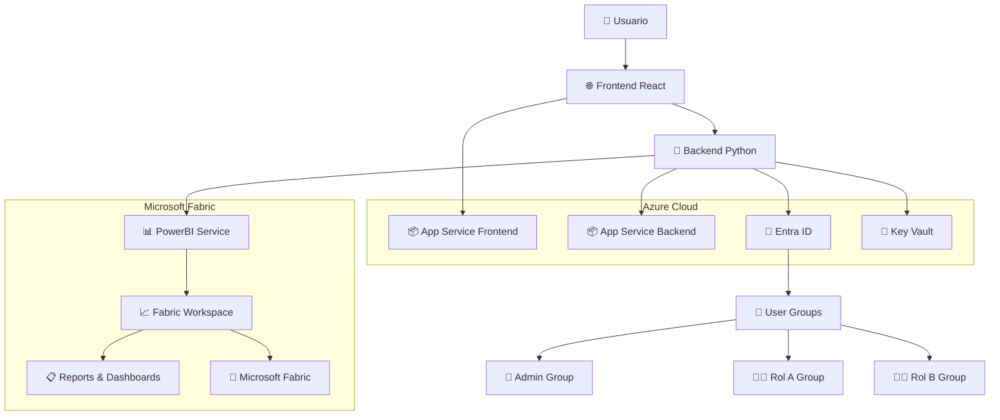
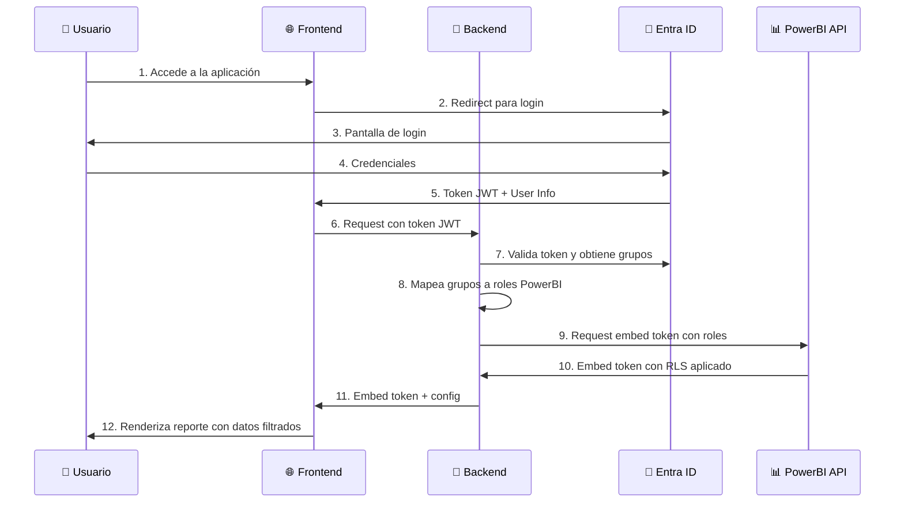
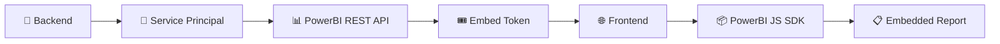
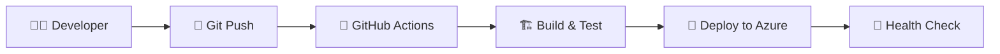

# Arquitectura del Sistema

## 🎯 Visión General

Esta aplicación implementa el patrón **"Embed for your customers"** de PowerBI utilizando **Microsoft Fabric Capacity**, donde los usuarios finales no requieren licencias de PowerBI Pro. La arquitectura está diseñada para ser escalable, segura y mantenible en Azure con la potencia completa de Microsoft Fabric.

## 🏗️ Diagrama de Arquitectura de Alto Nivel



## 🔄 Flujo de Autenticación y Autorización



## 🏢 Arquitectura de Componentes

### Frontend (React)
```
frontend/
├── src/
│   ├── components/
│   │   ├── auth/           # Componentes de autenticación
│   │   │   ├── Login.jsx
│   │   │   └── ProtectedRoute.jsx
│   │   ├── powerbi/        # Componentes de PowerBI
│   │   │   ├── PowerBIEmbed.jsx
│   │   │   └── ReportContainer.jsx
│   │   └── layout/         # Layout y navegación
│   │       ├── Header.jsx
│   │       ├── Sidebar.jsx
│   │       └── Layout.jsx
│   ├── pages/              # Páginas principales
│   │   ├── Dashboard.jsx
│   │   ├── Reports.jsx
│   │   └── Admin.jsx
│   ├── services/           # Servicios de API
│   │   ├── authService.js
│   │   ├── powerbiService.js
│   │   └── apiClient.js
│   └── utils/              # Utilidades
│       ├── constants.js
│       └── roleUtils.js
```

### Backend (Python/FastAPI)
```
backend/
├── src/
│   ├── auth/               # Módulo de autenticación
│   │   ├── entra_auth.py   # Integración con Entra ID
│   │   ├── middleware.py   # Middleware de autorización
│   │   └── models.py       # Modelos de usuario
│   ├── powerbi/            # Módulo de PowerBI
│   │   ├── service.py      # Servicio principal
│   │   ├── embed_service.py # Generación de embed tokens
│   │   └── rls_service.py   # Manejo de RLS
│   ├── routes/             # Endpoints de API
│   │   ├── auth_routes.py
│   │   ├── powerbi_routes.py
│   │   └── admin_routes.py
│   └── utils/              # Utilidades
│       ├── logger.py
│       └── helpers.py
```

## 🔐 Modelo de Seguridad

### 1. Autenticación (Entra ID)
- Los usuarios se autentican con sus credenciales de Entra ID
- MSAL maneja el flujo OAuth 2.0 / OpenID Connect
- Tokens JWT contienen información de grupos del usuario

### 2. Autorización (Grupos de Entra ID)
```
Entra ID Groups ──────────► PowerBI Roles
├── PBI-Admin    ──────────► Admin (ve todo)
├── PBI-RolA     ──────────► RolA (datos filtrados A)
└── PBI-RolB     ──────────► RolB (datos filtrados B)
```

### 3. Row Level Security (RLS)
- Configurado en el dataset de PowerBI
- Roles PowerBI filtran automáticamente los datos
- El backend mapea grupos de Entra ID a roles de PowerBI

### 4. Service Principal
- Aplicación registrada en Entra ID con permisos para PowerBI
- Genera embed tokens sin requerir licencias de usuario
- Almacenado en Azure Key Vault

## 📊 Microsoft Fabric Architecture

### Embed Token Flow


### RLS Configuration
```
Microsoft Fabric Dataset
├── Table: Sales
├── Table: Users
└── RLS Rules:
    ├── Admin: [Blank] (ve todo)
    ├── RolA: [Region] = "A"
    └── RolB: [Region] = "B"
```

## 🌐 Infraestructura en Azure

### Recursos Principales
| Recurso | SKU/Tier | Propósito |
|---------|----------|-----------|
| App Service Plan | B1 Linux | Host para frontend y backend |
| App Service (Frontend) | B1 | Aplicación React |
| App Service (Backend) | B1 | API Python |
| Microsoft Fabric Capacity | F8 | Capacity para reportes y análisis |
| Key Vault | Standard | Almacén de secrets |
| Entra ID | Free/Basic | Autenticación y autorización |

### Configuración de Red
- App Services públicos con HTTPS only
- Key Vault accesible solo desde App Services
- Microsoft Fabric Capacity en la misma región para latencia mínima

## 🔄 CI/CD Pipeline



### Stages del Pipeline
1. **Build**: Compilación de frontend y backend
2. **Test**: Ejecución de pruebas unitarias
3. **Security**: Escaneo de vulnerabilidades
4. **Deploy**: Despliegue a Azure App Services
5. **Health Check**: Validación de endpoints

## 📈 Escalabilidad y Performance

### Horizontal Scaling
- App Services pueden escalar automáticamente
- Microsoft Fabric F8 soporta hasta 200 usuarios concurrentes
- Upgrade a F16/F32 para mayor capacidad

### Caching Strategy
- Embed tokens cacheados en memoria (15 min lifetime)
- Metadatos de reportes cacheados (1 hora)
- User groups cacheados durante la sesión

### Monitoring Points
- Latencia de embed tokens
- Errores de autenticación
- Uso de Microsoft Fabric capacity
- Performance de App Services

## 🔧 Configuración de Ambiente

### Variables de Entorno
```bash
# Frontend
VITE_ENTRA_CLIENT_ID=xxx
VITE_ENTRA_AUTHORITY=xxx
VITE_API_BASE_URL=xxx

# Backend
ENTRA_CLIENT_ID=xxx
ENTRA_CLIENT_SECRET=xxx
ENTRA_TENANT_ID=xxx
POWERBI_CLIENT_ID=xxx
POWERBI_CLIENT_SECRET=xxx
```

### Secrets en Key Vault
- `fabric-client-secret`
- `entra-client-secret`
- `jwt-signing-key`

## 🚀 Deployment Strategy

### Blue-Green Deployment
1. Deploy a slot de staging
2. Warm-up y health checks
3. Swap a producción
4. Rollback automático si falla

### Zero-Downtime Requirements
- Graceful shutdown del backend
- Session persistence durante updates
- Health checks antes del swap

---

**📋 Esta arquitectura garantiza seguridad, escalabilidad y mantenibilidad para la solución de Microsoft Fabric Embedded.**